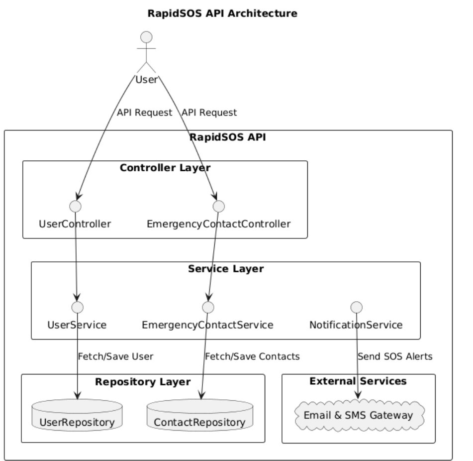

# RapidSOS API

A **Spring Boot** REST API designed for managing users and their emergency contacts efficiently. This API enables users to send **SOS alerts** via **SMS and email** to all registered emergency contacts.

---

The following diagram illustrates the high-level architecture of the **RapidSOS API**:



## Features
- **User Management**: Register, retrieve, and delete users.
- **Emergency Contacts**: Add, fetch, and delete emergency contacts.
- **SOS Alerts**: Send **real-time SMS and email alerts** to emergency contacts.
- **Secure & Scalable**: Uses Spring Security & best practices.
- **Database Support**: Works with MySQL or H2 (for testing).
- **API Error Handling**: Provides structured responses for errors.

---

## Tech Stack
- **Spring Boot** (Java 17+)
- **Spring Data JPA** (Database Management)
- **Twilio API** (For sending SMS alerts)
- **JavaMailSender** (For sending SOS emails)
- **MySQL Database**
- **Spring Web** (REST API)
- **Spring Boot Validation** (Input validation)

---

## Installation & Setup

### 1️⃣ Clone the Repository
```sh
git clone https://github.com/Hariharan1893/RapidSOS-API.git
cd rapidsos-api
```

### 2️⃣ Configure Environment Variables
- Create a `.env` or use `application.properties` for sensitive credentials:
```properties
# Database Configuration
spring.datasource.url=jdbc:mysql://localhost:3306/rapidsos_db
spring.datasource.username=root
spring.datasource.password=yourpassword
spring.jpa.hibernate.ddl-auto=update

# Twilio (for SMS)
twilio.account_sid=your_twilio_account_sid
twilio.auth_token=your_twilio_auth_token
twilio.phone_number=your_twilio_phone_number

# Email (JavaMailSender)
spring.mail.host=smtp.gmail.com
spring.mail.port=587
spring.mail.username=your_email@gmail.com
spring.mail.password=your_email_password
spring.mail.properties.mail.smtp.auth=true
spring.mail.properties.mail.smtp.starttls.enable=true
```
- Ensure **Twilio** and **SMTP email credentials** are set up.

### 3️⃣ Build & Run the Application
#### Using Maven:
```sh
mvn clean install
mvn spring-boot:run
```
#### Running as a JAR:
```sh
mvn package
java -jar target/rapidsos-api-0.0.1-SNAPSHOT.jar
```

---

## 📡 API Endpoints
Base URL: `http://localhost:8080/api`

| HTTP Method | Endpoint | Description |
|------------|-----------------------------|----------------------------------------------|
| **POST**   | `/users/register`           | Register a new user                         |
| **GET**    | `/users/{userId}`           | Get user details by ID                      |
| **DELETE** | `/users/{userId}`           | Delete a user by ID                         |
| **POST**   | `/users/{userId}/contacts`  | Add an emergency contact                    |
| **GET**    | `/users/{userId}/contacts`  | Get all emergency contacts                  |
| **DELETE** | `/users/{userId}/contacts/{contactId}` | Delete an emergency contact |
| **POST**   | `/sos/{userId}`       | Send SOS alert via SMS & Email to all contacts |

## ⚖ License
This project is licensed under the **MIT License**.


